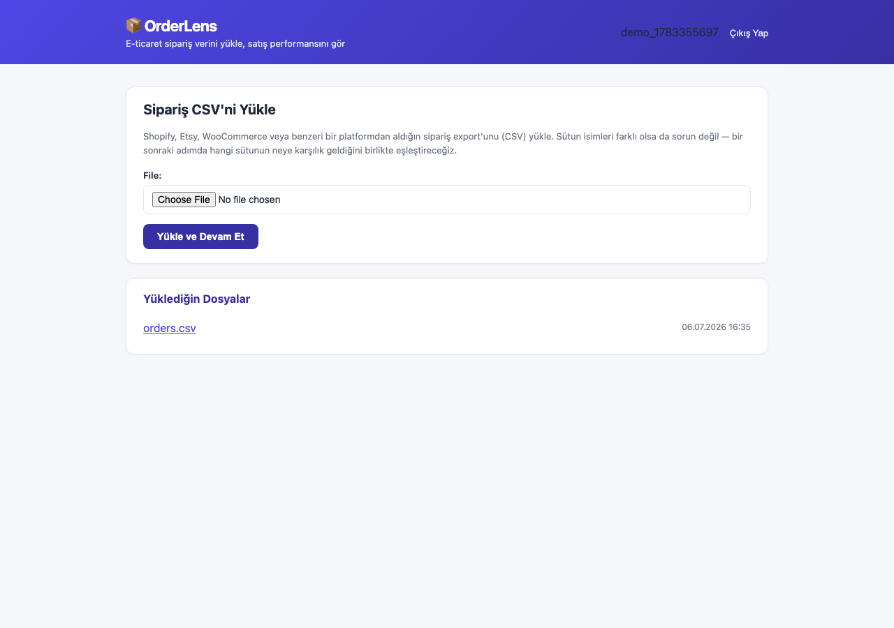
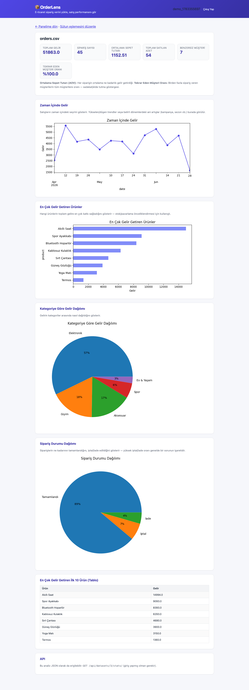

# OrderLens

E-ticaret satıcıları için sipariş CSV export'larını (Shopify, Etsy, WooCommerce, Trendyol vb.) birkaç adımda bir satış analiz panosuna çeviren bir Django uygulaması.

**Canlı demo:** _(deploy sonrası eklenecek)_ — `demo` / `demo1234` ile giriş yapıp önceden yüklenmiş örnek veriyi inceleyebilirsin.

Küçük bir e-ticaret satıcısı genelde siparişlerini Excel/Google Sheets'te elle karıştırıp gelir, en çok satan ürün, tekrar eden müşteri gibi soruların cevabını arar. OrderLens bu CSV'yi yükleyip birkaç saniyede bu soruların cevabını, ilgili grafiklerle birlikte veriyor.

## Özellikler

- **Sütun eşleme**: Farklı platformların farklı CSV başlıklarını (`Order Date`, `Total`, `tarih`, `tutar`...) varsaymak yerine, yüklenen dosyanın başlıklarını otomatik tahmin edip kullanıcıya onaylatan bir eşleme adımı.
- **Asenkron analiz (Celery + Redis)**: Sütun eşlemesi kaydedildiğinde analiz arka planda bir Celery worker'da hesaplanır; kullanıcı bu sırada basit bir "hazırlanıyor" sayfası görür, sonuç `AnalysisResult` tablosunda önbelleklenir. Hem web sayfası hem API bu önbellekten okur — her istekte pandas'ı yeniden çalıştırmaz.
- **KPI panosu**: Toplam gelir, sipariş sayısı, ortalama sepet tutarı (AOV), benzersiz müşteri sayısı, tekrar eden müşteri oranı.
- **Grafikler**: Zaman içinde gelir trendi, en çok gelir getiren ürünler, kategoriye göre gelir dağılımı, sipariş durumu (tamamlandı/iptal/iade) dağılımı.
- **REST API**: Aynı analiz verisi `GET /api/datasets/<id>/stats/` üzerinden JSON olarak da alınabilir (Django REST Framework); henüz hazır değilse `202 Accepted` döner. Otomatik OpenAPI/Swagger dokümantasyonu `/api/docs/` adresinde.
- **Çok kullanıcılı**: Kayıt/giriş sistemi var, her satıcı sadece kendi yüklediği dosyaları görür.
- **Docker + CI**: `docker-compose` ile web/worker/Postgres/Redis tek komutla ayağa kalkar; GitHub Actions her push'ta test suite'ini Postgres+Redis servisleriyle çalıştırır.

## Ekran Görüntüleri

**Panel** — sipariş CSV'ni yükle, geçmiş yüklemelerini gör


**Sütun Eşleme** — CSV'nin başlıkları otomatik tahmin edilir, gerekirse düzelt


**Analiz** — KPI'lar ve grafikler


## Teknoloji

- **Backend**: Django 4.2, Django REST Framework, drf-spectacular (OpenAPI/Swagger)
- **Asenkron işleme**: Celery + Redis
- **Veri işleme**: pandas
- **Grafikler**: matplotlib (arka planda render edilip base64 olarak gömülür — ayrı bir JS grafik kütüphanesi gerekmez)
- **Auth**: Django'nun yerleşik auth sistemi
- **Veritabanı**: Postgres (Docker/production), SQLite'a düşer (hızlı yerel geliştirme, `DATABASE_URL` tanımlı değilse)
- **DevOps**: Docker + docker-compose, GitHub Actions CI

## Kurulum — Docker (önerilen)

```bash
git clone <bu-repo>
cd orderlens
docker compose up --build
```

`http://localhost:8000` adresine git. Bu komut web + Celery worker + Postgres + Redis'i birlikte ayağa kaldırır; migration'lar `web` servisi başlarken otomatik çalışır.

## Kurulum — yerel (Docker'sız, hızlı deneme)

```bash
python3 -m venv venv
source venv/bin/activate
pip install -r requirements.txt
python manage.py migrate
python manage.py runserver
```

Bu şekilde SQLite kullanılır ve `DATABASE_URL` tanımlı değildir. **Not:** Celery task'ları gerçek bir Redis broker olmadan `.delay()` çağrısında bağlanmaya çalışır — yerelde Redis çalıştırmıyorsan (`docker run -p 6379:6379 redis:7` yeterli) ve ayrı bir `celery -A datalens worker -l info` başlatmıyorsan, sütun eşleme sonrası analiz sonsuza kadar "hazırlanıyor" sayfasında kalır. Test suite bunu etkilemez — testler Celery'yi eager (senkron) modda çalıştırır.

`http://127.0.0.1:8000` adresine git, bir hesap oluştur, ve `sample_data/orders.csv` dosyasını yükleyerek dene.

## Testler

```bash
python manage.py test analyzer
```

12 test: giriş zorunluluğu, kullanıcılar arası veri izolasyonu, sütun eşleme tahmini, metrik hesaplamalarının doğruluğu, asenkron analiz akışı (işleniyor durumu, başarısızlık durumu, `run_analysis` task'ının doğru sonucu ürettiği), ve uçtan uca kayıt→yükleme→eşleme→analiz→API akışı. GitHub Actions her push'ta bu testleri Postgres+Redis servisleriyle çalıştırır (bkz. `.github/workflows/ci.yml`).

## API Örneği

```
GET /api/datasets/1/stats/
```

```json
{
  "order_count": 45,
  "total_revenue": 51863.0,
  "aov": 1152.51,
  "total_units": 54,
  "unique_customers": 7,
  "repeat_customer_rate": 100.0,
  "top_products": [
    {"name": "Akıllı Saat", "revenue": 14994.0},
    {"name": "Spor Ayakkabı", "revenue": 9093.0}
  ],
  "category_revenue": [
    {"name": "Elektronik", "revenue": 29680.0}
  ],
  "status_counts": [
    {"name": "Tamamlandı", "count": 40},
    {"name": "İptal", "count": 3}
  ]
}
```

Analiz henüz hazır değilse (worker daha işlemi bitirmediyse) aynı endpoint `202 Accepted` ile `{"status": "processing", "detail": "..."}` döner. Tam OpenAPI şeması ve interaktif dokümantasyon: `/api/docs/`.

## Deployment

`render.yaml`, Postgres + Redis + web + Celery worker olacak şekilde bir [Render](https://render.com) Blueprint'i tanımlıyor. Build adımında migration'lar çalışır ve `seed_demo` komutu bir demo hesabı (`demo` / `demo1234`) + önceden eşlenmiş örnek veri oluşturur — idempotent, her deploy'da güvenle tekrar çalışır.

> **Not:** Bu blueprint henüz gerçek bir Render hesabında test edilmedi (deploy adımı ayrı bir sonraki iş). Render'ın ücretsiz Postgres/Redis planları belirli bir süre sonra sona erebilir — uzun vadeli bir canlı demo için bu planların yenilenmesi gerekir.

## Docker mimarisi

`docker-compose.yml` dört servis tanımlar: `web` (Django + gunicorn), `worker` (Celery), `db` (Postgres 16), `redis` (Redis 7). Analiz akışı: sütun eşlemesi kaydedilir → `run_analysis` task'ı worker'a gönderilir → worker pandas ile hesaplayıp `AnalysisResult`'a yazar → web süreci sonucu önbellekten okur. Bu, büyük CSV'lerin HTTP isteğini bloklamasını engeller ve web/API her istekte pandas'ı yeniden çalıştırmaz.

## Proje Yapısı

```
analyzer/
  analysis.py     # sütun eşleme tahmini, metrik hesaplama, grafik üretimi (saf fonksiyonlar)
  tasks.py        # run_analysis Celery task'ı — analysis.py'yi çağırıp AnalysisResult'a yazar
  models.py       # Dataset (owner, column_mapping), AnalysisResult (status, metrics, charts)
  views.py        # auth, yükleme, eşleme, analiz (+ işleniyor sayfası) view'ları
  api_views.py    # DRF API endpoint (202/200/422 durumları)
  serializers.py  # API yanıt şemaları (Swagger dokümantasyonu için)
  forms.py        # yükleme formu, dinamik sütun eşleme formu, kayıt formu
  templates/      # tüm HTML şablonları
datalens/
  celery.py       # Celery app kurulumu
sample_data/
  orders.csv      # denemek için gerçekçi bir örnek sipariş export'u
Dockerfile, docker-compose.yml, .github/workflows/ci.yml
```

## Lisans

MIT
