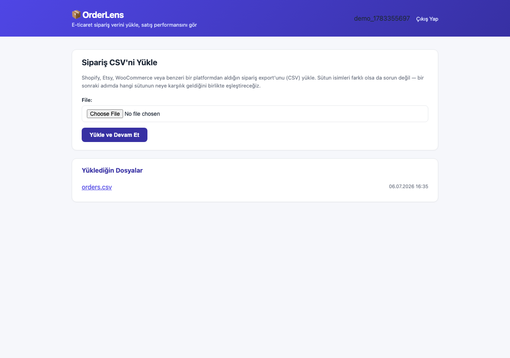
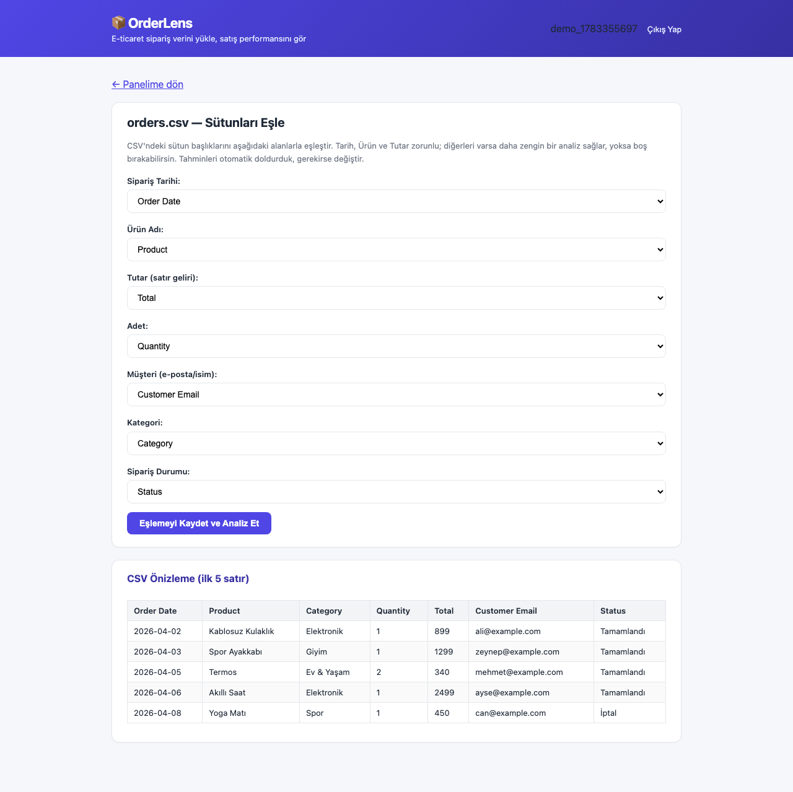
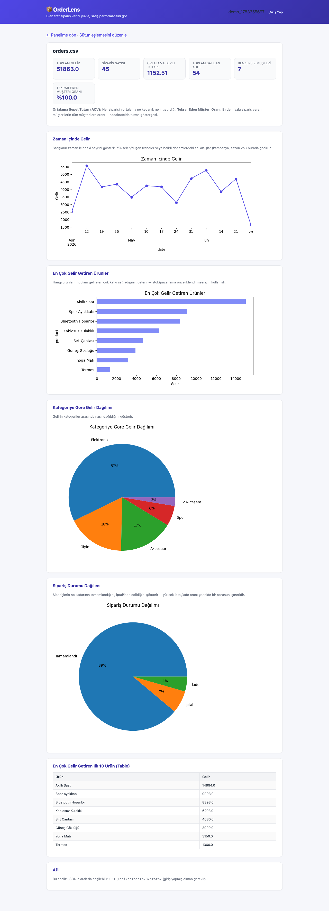

# OrderLens

A Django app that turns e-commerce order CSV exports (Shopify, Etsy, WooCommerce, Trendyol, etc.) into a sales analytics dashboard in a few steps.

**Live demo:** [orderlens-xkef.onrender.com](https://orderlens-xkef.onrender.com) — log in with `demo` / `demo1234` to explore pre-loaded sample data. (The free Render plan spins down when idle, so the first request may take ~30-50 seconds.)

A small e-commerce seller usually digs through Excel/Google Sheets by hand to answer questions like revenue, best-selling products, or repeat customers. OrderLens takes that CSV and answers those questions in a few seconds, with charts to match.

## Features

- **Column mapping**: Instead of assuming every platform uses the same CSV headers (`Order Date`, `Total`, `date`, `amount`...), the uploaded file's headers are auto-detected and the user confirms the mapping in a dedicated step.
- **Asynchronous analysis (Celery + Redis)**: Once column mapping is saved, the analysis is computed in the background by a Celery worker; the user sees a simple "processing" page in the meantime, and the result is cached in the `AnalysisResult` table. Both the web page and the API read from this cache — pandas isn't re-run on every request.
- **KPI dashboard**: Total revenue, order count, average order value (AOV), unique customers, repeat customer rate.
- **Charts**: Revenue trend over time, top revenue-generating products, revenue by category, order status (completed/cancelled/refunded) breakdown.
- **REST API**: The same analytics are available as JSON via `GET /api/datasets/<id>/stats/` (Django REST Framework); returns `202 Accepted` if not ready yet. Auto-generated OpenAPI/Swagger docs at `/api/docs/`.
- **Multi-user**: Sign-up/login system; each seller only sees the files they uploaded.
- **Docker + CI**: `docker-compose` spins up web/worker/Postgres/Redis with one command; GitHub Actions runs the test suite against real Postgres+Redis services on every push.

## Screenshots

**Dashboard** — upload your order CSV, see your past uploads


**Column Mapping** — the CSV's headers are auto-detected, adjust if needed


**Analysis** — KPIs and charts


## Tech Stack

- **Backend**: Django 4.2, Django REST Framework, drf-spectacular (OpenAPI/Swagger)
- **Async processing**: Celery + Redis
- **Data processing**: pandas
- **Charts**: matplotlib (rendered server-side and embedded as base64 — no separate JS charting library needed)
- **Auth**: Django's built-in auth system
- **Database**: Postgres (Docker/production), falls back to SQLite for fast local development if `DATABASE_URL` isn't set
- **DevOps**: Docker + docker-compose, GitHub Actions CI

## Setup — Docker (recommended)

```bash
git clone <this-repo>
cd orderlens
docker compose up --build
```

Visit `http://localhost:8000`. This spins up web + Celery worker + Postgres + Redis together; migrations run automatically when the `web` service starts.

## Setup — local (without Docker, for quick testing)

```bash
python3 -m venv venv
source venv/bin/activate
pip install -r requirements.txt
python manage.py migrate
python manage.py runserver
```

This uses SQLite and no `DATABASE_URL` is set. **Note:** Celery tasks try to connect to a real Redis broker when `.delay()` is called — if you're not running Redis locally (`docker run -p 6379:6379 redis:7` is enough) and don't have a separate `celery -A datalens worker -l info` running, the analysis will stay stuck on the "processing" page after column mapping forever. This doesn't affect the test suite — tests run Celery in eager (synchronous) mode.

Visit `http://127.0.0.1:8000`, create an account, and try it out with `sample_data/orders.csv`.

## Tests

```bash
python manage.py test analyzer
```

12 tests: login requirement, data isolation between users, column mapping detection, metric calculation accuracy, the async analysis flow (processing state, failure state, that the `run_analysis` task produces the correct result), and the full end-to-end register→upload→map→analyze→API flow. GitHub Actions runs these tests against real Postgres+Redis services on every push (see `.github/workflows/ci.yml`).

## API Example

```
GET /api/datasets/1/stats/
```

```json
{
  "order_count": 45,
  "total_revenue": 51863.0,
  "aov": 1152.51,
  "total_units": 54,
  "unique_customers": 7,
  "repeat_customer_rate": 100.0,
  "top_products": [
    {"name": "Smart Watch", "revenue": 14994.0},
    {"name": "Running Shoes", "revenue": 9093.0}
  ],
  "category_revenue": [
    {"name": "Electronics", "revenue": 29680.0}
  ],
  "status_counts": [
    {"name": "Completed", "count": 40},
    {"name": "Cancelled", "count": 3}
  ]
}
```

If the analysis isn't ready yet (the worker hasn't finished), the same endpoint returns `202 Accepted` with `{"status": "processing", "detail": "..."}`. Full OpenAPI schema and interactive docs: `/api/docs/`.

## Deployment

`render.yaml` defines a [Render](https://render.com) Blueprint with Postgres + Redis + web. The build step runs migrations, and the `seed_demo` command creates a demo account (`demo` / `demo1234`) + a pre-mapped sample dataset — idempotent, safe to re-run on every deploy.

> **Note:** Render's free plan doesn't support a separate "background worker" service type, so in production (unlike Docker) the Celery worker runs inside the web dyno in the background (`--detach`) — see the `startCommand` in `render.yaml`. On a paid plan, this could be split into its own `type: worker` service, as in `docker-compose.yml`. Also, Render's free Postgres/Redis plans can expire after a while — a long-running live demo would need those plans renewed.

## Docker Architecture

`docker-compose.yml` defines four services: `web` (Django + gunicorn), `worker` (Celery), `db` (Postgres 16), `redis` (Redis 7). Analysis flow: column mapping is saved → the `run_analysis` task is sent to the worker → the worker computes it with pandas and writes to `AnalysisResult` → the web process reads the result from cache. This keeps large CSVs from blocking the HTTP request, and the web/API never re-runs pandas on every request.

## Project Structure

```
analyzer/
  analysis.py     # column mapping detection, metric computation, chart generation (pure functions)
  tasks.py        # run_analysis Celery task — calls analysis.py and writes to AnalysisResult
  models.py       # Dataset (owner, column_mapping), AnalysisResult (status, metrics, charts)
  views.py        # auth, upload, mapping, analysis (+ processing page) views
  api_views.py    # DRF API endpoint (202/200/422 states)
  serializers.py  # API response schemas (for Swagger docs)
  forms.py        # upload form, dynamic column mapping form, registration form
  templates/       # all HTML templates
datalens/
  celery.py       # Celery app setup
sample_data/
  orders.csv      # a realistic sample order export to try it out with
Dockerfile, docker-compose.yml, .github/workflows/ci.yml
```

## License

MIT
